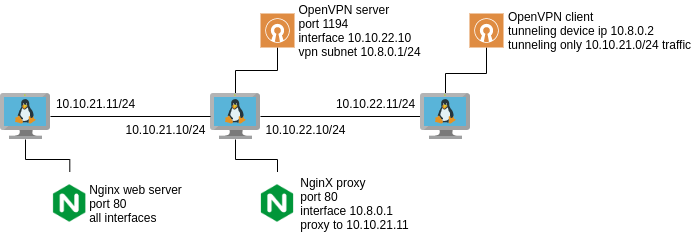

# DevSecOps Workshops : OpenVPN

This is a brief introduction to OpenVPN, followed by a workshop. For the workshop material, visit <a href="https://github.com/mdnfiras/devsecops-openvpn" target="_blank">github.com/mdnfiras/devsecops-openvpn</a>. For a complete documentation, visit <a href="https://openvpn.net/community-resources/" target="_blank">openvpn.net/community-resources/</a>.

## What is a VPN?

A virtual private network extends a private network across a public network and enables users to send and receive data across shared or public networks as if their computing devices were directly connected to the private network.

## What is OpenVPN?

OpenVPN is a virtual private network system that helps create secure point-to-point or site-to-site connections. It implements both client and server applications. Check <a href="https://openvpn.net/">openvpn.net</a> for more details.

## Start using OpenVPN

The OpenVPN server virtual machine `vpn-server` in this tutorial will consume 1 GB of RAM and 2 vCPUs. Two other virtual machines `vpn-web` and `vpn-client` will each consume 512 MB of RAM and 1 vCPU, making it a total of 2 GB of RAM and 4 vCPUs.

In this workshop, we will try to implement the following architecture:



### Setup a web server:

Launch & ssh into the `vpn-web` VM. This VM will have one network interface connected to the `10.10.21.0/24` network with IP `10.10.21.11`. Install Nginx and copy our custom `index.html` file to `/var/www/html/index.html`.

```bash
sudo apt update
sudo apt install -y nginx
sudo cp /vagrant/index.html /var/www/html/index.html
```

Check the web page:

```bash
curl localhost
```

### Setup an OpenVPN server:

Launch & ssh into the `vpn-server` VM. This VM will have two network interfaces connected to two different networks: the web server side network `10.10.21.0/24` with IP `10.10.21.10` and the client side network `10.10.22.0/24` with IP `10.10.22.10`. Verify that you can reach the web server's web page, and that you can ping the client:

```bash
# should succeed
ping 10.10.21.11
# should return nginx default web page
curl 10.10.21.11
```

```bash
# should succeed
ping 10.10.22.11
```

Install NginX to use as a proxy. Configure it using our `nginx.conf` file. In that file, the NginX proxy is configured to listen on `10.8.0.1:80`, which is the IP address that we will set up for our OpenVPN server, then proxy the web traffic to the internal web server.

```bash
sudo apt update
sudo apt install -y nginx
sudo cp /vagrant/nginx.conf /etc/nginx/nginx.conf
```

Do not restart the NginX service yet, as we have not set up the `10.8.0.1` tunneling interface yet. Copy the helper script from `/vagrant/openvpn-install.sh` into a new location and allow it to be executed, then run it. The helper script will ask you for some information in order to configure OpenVPN server. This makes the configuration simple.

```bash
cp /vagrant/openvpn-install.sh openvpn-install.sh
chmod u+x /home/vagrant/openvpn-install.sh
sudo ./openvpn-install.sh
```

Chose the following configuration options:

```
Welcome to this OpenVPN road warrior installer!

Possible IP local addresses:
     1) 10.0.2.15
     2) 10.10.21.10
     3) 10.10.22.10
IPv4 address [1]: 3

Possible protocols:
   1) UDP (recommended)
   2) TCP
Protocol [1]: 1

Port to listen to:
Port [1194]: 1194            

Possible DNS servers:
   1) Current system resolvers
   2) Google
   3) 1.1.1.1
   4) OpenDNS
   5) Quad9
   6) AdGuard
DNS server [1]: 1

OpenVPN installation is ready to begin.
Press any key to continue...
```

Chosing `10.10.22.10` as the IP address will instruct the OpenVPN server to listen on incoming requests from that interface, which is facing the client VM `vpn-client`. You can verify that the service is up and running:

```bash
sudo service openvpn-server@server status
```

Now that the new tunneling interface of the VPN has been configured with the IP address 10.8.0.1 (using the helper script), you can check it out using `ip addr`. You can now restart the Nginx service so that it loads the new configuration.

```bash
sudo service nginx restart
curl 10.8.0.1
```

### Setup an OpenVPN client:

Now in the `vpn-server` VM, run the helper script again, it should detect that OpenVPN server is installed and provide you will additional options. Chose the option to create a new client.

```bash
sudo ./openvpn-install.sh
```

```
OpenVPN is already installed.

Select an option:
   1) Add a new client
   2) Revoke an existing client
   3) Remove OpenVPN
   4) Exit
Option: 1

Provide a name for the client:
Name: myclient
```

For a client named `myclient`, you should find the client configuration at `/root/myclient.ovpn`. Copy it to `/vagrant/myclient.ovpn`.

```bash
sudo cp /root/myclient.ovpn /vagrant/myclient.ovpn
```

Exit the server's SSH session, launch & SSH into the `vpn-client` VM. This machine will be connected to the `10.10.22.0/24` network with IP `10.10.22.11`. Verify that you CANNOT reach the `vpn-web` VM, and that you CAN reach the `vpn-server` VM:

```bash
# should fail
ping 10.10.21.11
ping 10.10.21.10
curl 10.10.21.11
curl 10.10.21.10
```

```bash
# should succeed
ping 10.10.22.10
```

Install OpenVPN:

```bash
sudo apt update
sudo apt install -y openvpn
```

Run the client OpenVPN in the background using the `myclient` client configuration file. This will cause our client to join the VPN and get an IP address `10.8.0.2` on its tunneling interface. Every client that joins gets an IP address in the subnet `10.8.0.0/24` and can reach any other client within the VPN. However, we have not added our web server to this VPN, but we will be able to reach it thanks to the reverse proxy we configured in the `vpn-server`.

```bash
sudo openvpn --config /vagrant/myclient.ovpn &
```

Check again!

```bash
# should succeed
ping 10.8.0.1
curl 10.8.0.1
```

